# Box Turtle Overmolded Tires
# Thank you to Transmutated in the Box Turtle Discord for the excellent writeup and pictures!

Discussion here: [Discord Box Turtle Discussion](https://discord.com/channels/1229586267671629945/1315355814512562242 "Discord Box Turtle discussion").

## Tools
* hot glue gun
* hobby knife
* small pliers
* diagonal cutting pliers or something else strong enough to cut the "ice-cube tray"
* fine-tipped screwdriver or similar prying device

## Materials
* two-part rubber silicone; 10a, 15a and 20a will work.

## STL Files To Print
You can print these in whatever sacrificial filament you want to use as most of these parts won't be reusable. 
## The exception is the new-style wheels. Print these in whatever filament you are printing all of your accent color parts in to match your box turtle build.

Print settings:
- 0.2mm layer height.
- The Spiral Insert should be printed in vase mode and using the arachne wall generator. 
(Quality, Wall Generator, Arachne). Thanks Robnex!

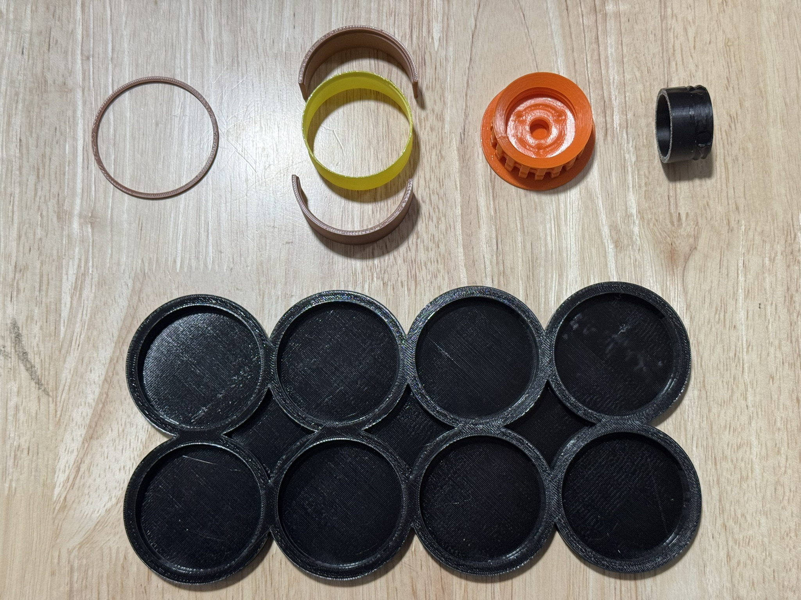

* 1 x [Ice Cube Tray](https://github.com/WheelsTheCat/bt-overmolded-tires/blob/main/stls/Ice%20Cube%20Tray.stl) - second row, position 1 in black
* 8 x [Retainers](https://github.com/WheelsTheCat/bt-overmolded-tires/blob/main/stls/Retainer.stl) - first row, position 1 in brown
* 8 x [Part 1](https://github.com/WheelsTheCat/bt-overmolded-tires/blob/main/stls/Part%201.stl) - first row, position 2, above yellow spiral insert
* 8 x [Part 2](https://github.com/WheelsTheCat/bt-overmolded-tires/blob/main/stls/Part%202.stl) - first row, position 2, below yellow spiral insert
* 8 x [Spiral Inserts](https://github.com/WheelsTheCat/bt-overmolded-tires/blob/main/stls/Spiral%20Insert.stl) first row, position two, in yellow
* 8 x [New Style Wheels](https://github.com/WheelsTheCat/bt-overmolded-tires/blob/main/stls/New%20Style%20Wheel.stl) first row, position 3, in orange
* 8 x [New Style Wheel Plugs](https://github.com/WheelsTheCat/bt-overmolded-tires/blob/main/stls/New%20Style%20Wheel%20Plug.stl) first row, position 4, in black

## Step 1
Assemble the spiral inserts combined with the retainer and parts 1 & 2. Observe that there is a lip that must be aligned for both parts and the spiral inserts. Once assembled, slide the retainer clip over the parts to keep them fastened. We'll call this the mold shell.

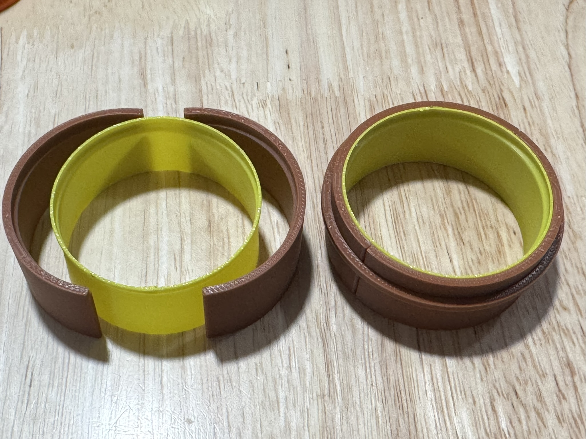

## Step 2
Attach the plug to the new-style wheel as pictured. Be sure the plug contacts the bottom of the wheel base.

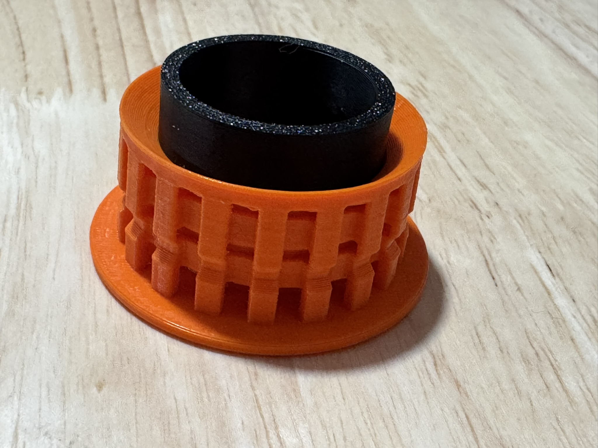

## Step 3
Place the assembled wheel base into each of the ice cube tray slots and then place the assembled mold shell on top of the wheel as shown. Using your hot glue gun, place a generous amount of hot glue around the base of the shell and the ice cube tray. This will ensure the poured rubber silicone won't leak much.

For sections between two wheels where it may be difficult to use the hot glue gun, you can apply a bit of hot glue to the side of the shell 5mm above the bottom. When you place the shell in the tray, it'll properly seal that section.

I found it easiest to work on two at a time instead of doing them all at once.

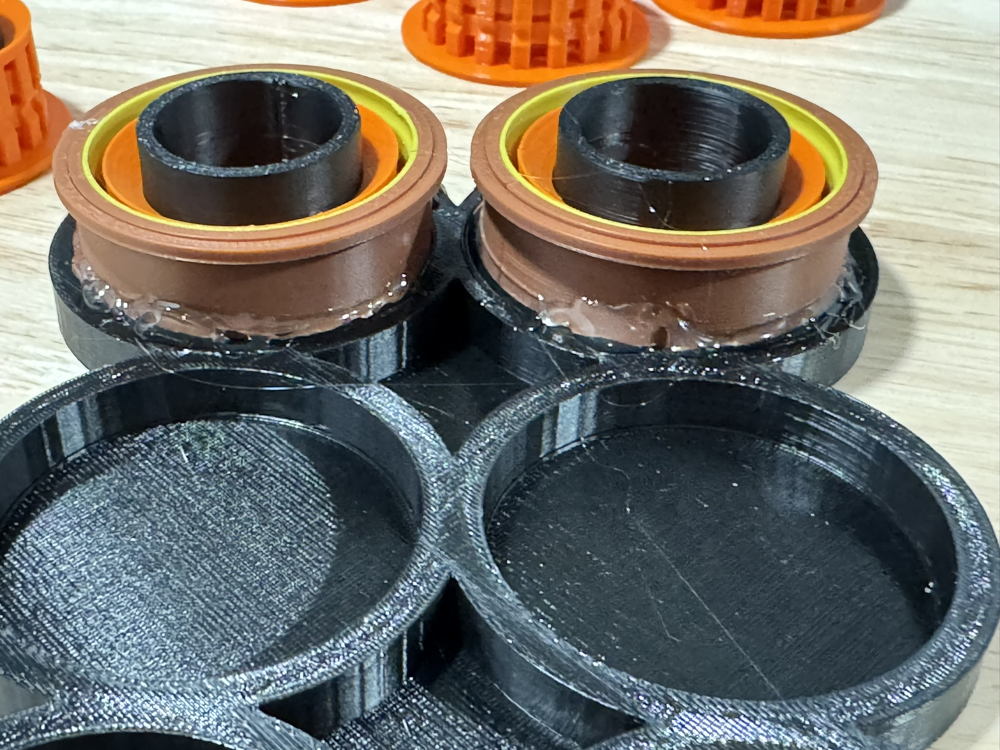
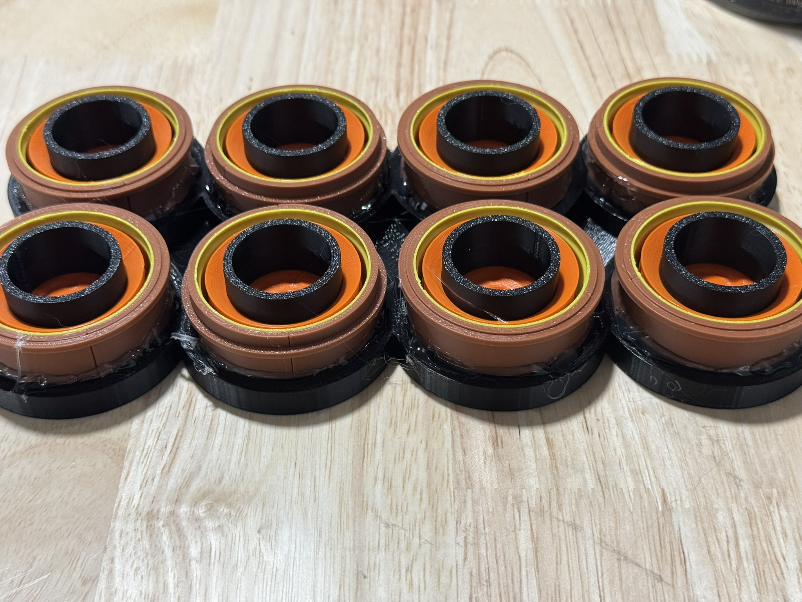

## Step 4
Now it's time to pour the material into the mold. Mix your material as instructed. Mixing a combined total of 150-160g of material should be sufficient. If you would like to color your rubber silicone, you can use mica powder. For reference, I used black and mixed 160g of material and used 5g of mica powder, and that was a rich black.

Fill to the brim of the shell. Don't worry if some material goes into the well where the plug is while moving between wheels; it'll seep in anyway but is easy to clean out when dry. Avoid it, but don't panic or try to clean it when wet.

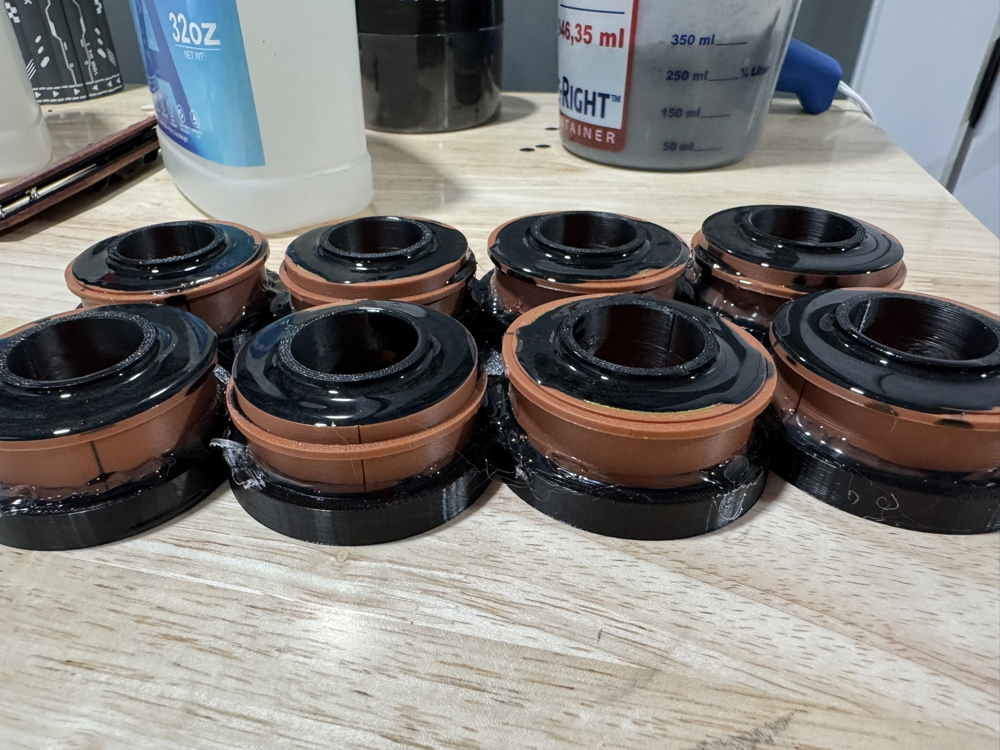

## Step 5
Break the molds! The ice cube tray is entirely sacrificial. I used diagonal clippers to effectively compromise the rings. From there, I used a pair of pliers to further create separation. I also found it useful to break the ice cube tray in half. This part of the write-up is use whatever means necessary to free the parts really.

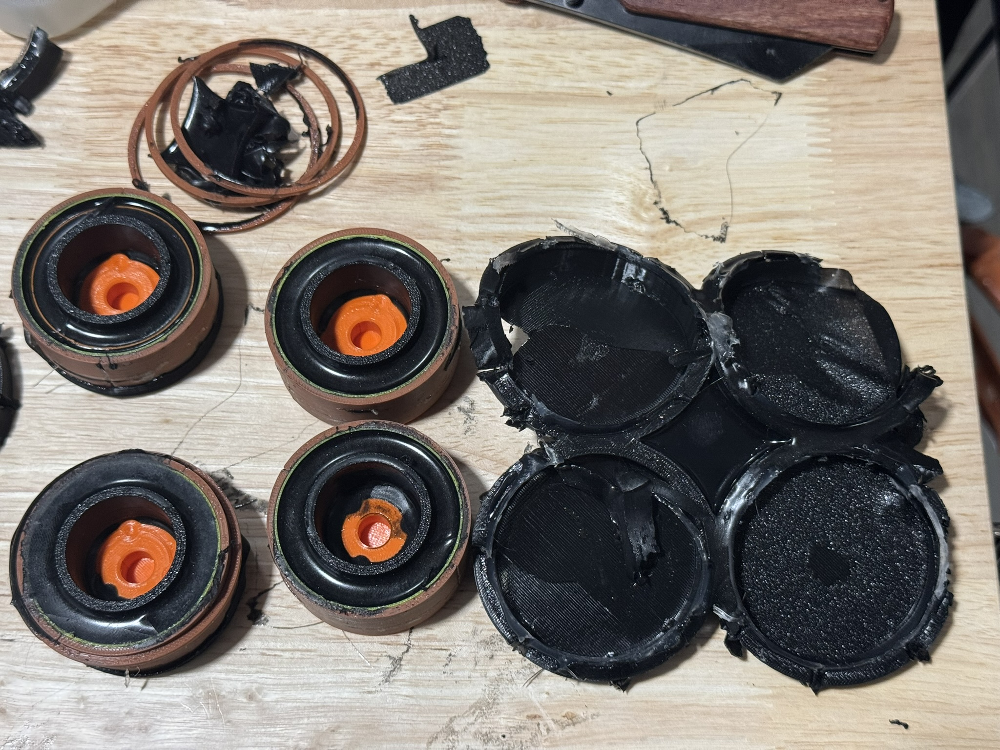

Once the parts are free of the ice cube tray, use something small to wedge between parts 1 or 2 and the spiral inserts. This shouldn't take much pressure, but I was careful as I didn't want to damage the molded parts.

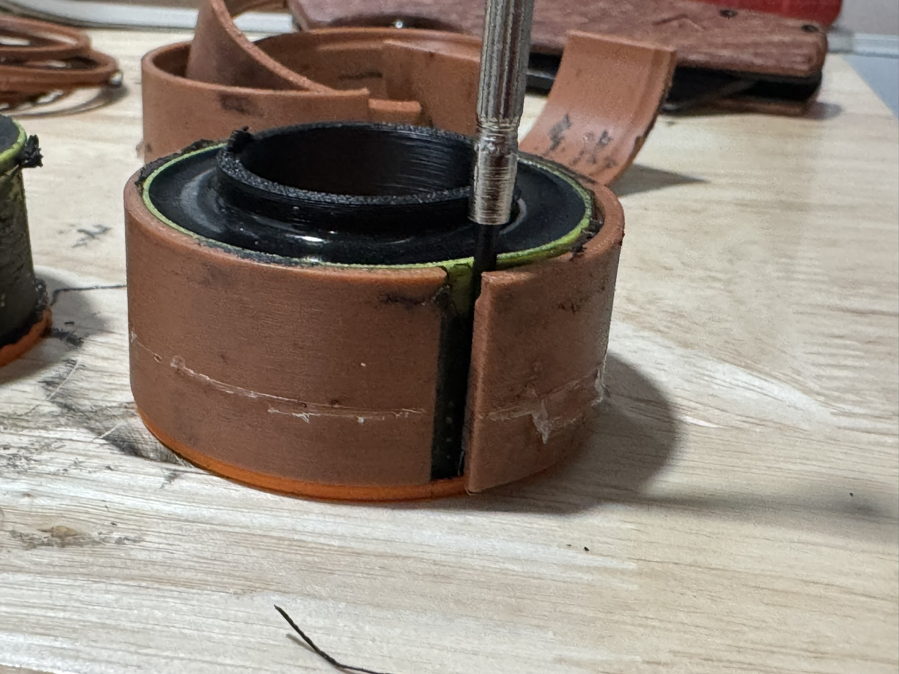

I didn't take a picture since it required two hands to do it, but you can use a hobby knife to score the spiral inserts and then remove them from the molded part.

Next, you'll use a pair of pliers and grab the plug. With your other hand, simply grab the base of the wheel and turn it until the plug is fully removed unthreaded from the wheel.

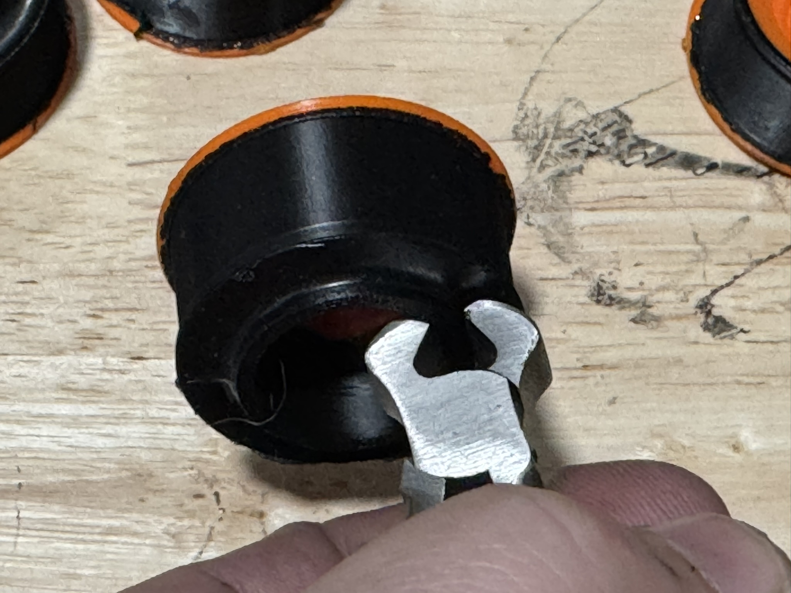

## Step 6
At this stage, you should have removed all mold shells and plugs and be left with a hopefully good-looking wheel. I spent a few minutes on each wheel with my hobby knife to lightly trim the excess material that got out between my shell and the wheel. Once scored, it was easy to remove the material. May not have even needed to use the knife, but I wanted to make sure it looked nice.

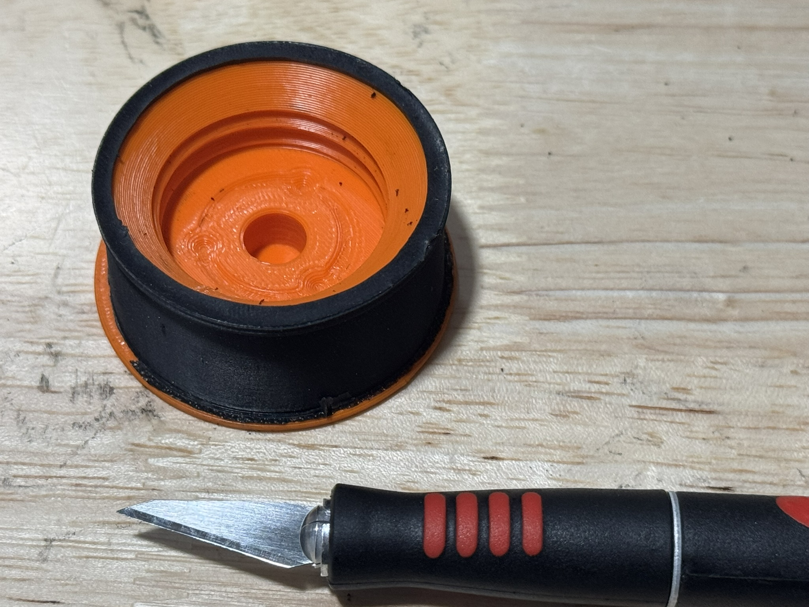

I didn't take a picture of it, but I had a good bit of rubber that was overlapping into the sloped area of the wheel. I cleaned this up with the hobby knife. Basically, I would jab the knife into the overlap and try to angle it between the outer wall of the wheel and basically went around the wheel with the knife. You end up with rubber donuts. The rubber pulls from the edge pretty easily here on the top edge.

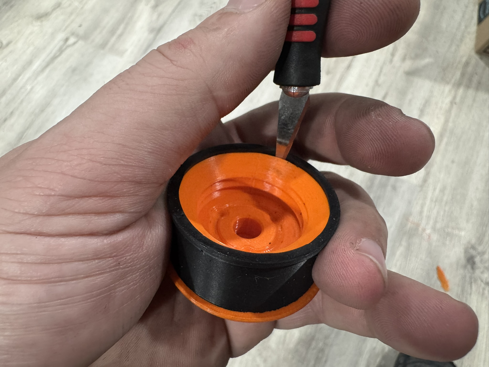

Here is what the donuts look like after you clean the excess out of the area.

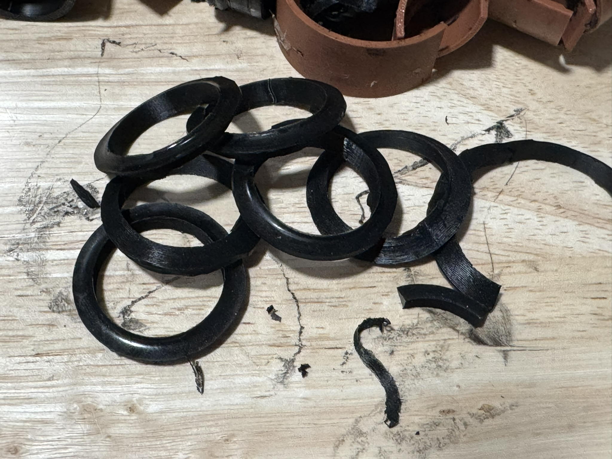

# End Results
My wheels came out very smooth and the 10a hardness rubber is extra soft and grippy. The mica powder I used had some glitter flakes, but that shouldn't impact anything. Looks really good and I'm sure this will be a bit nicer than the TPU. I can't say I'd change anything in the process at this point.

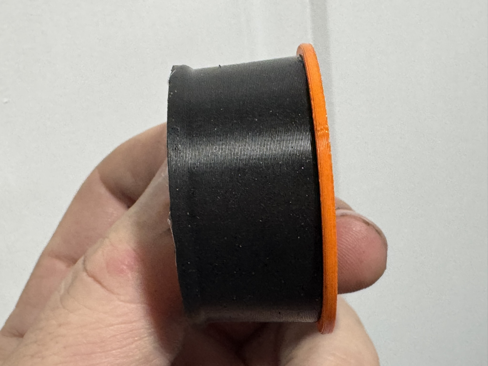
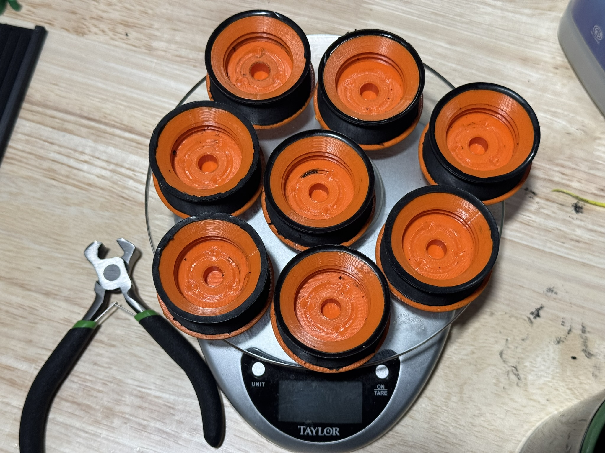
